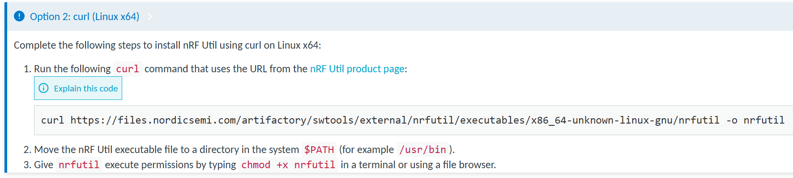
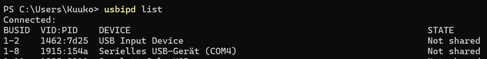
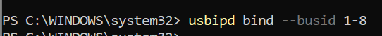
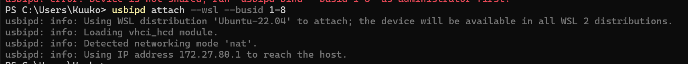
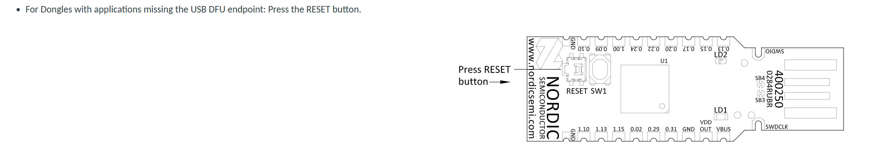
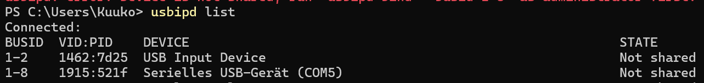
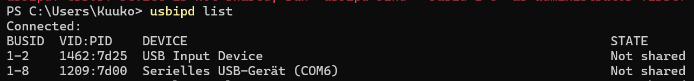

# Development on WSL

To install WSL refer to this [guide](https://doc.riot-os.org/getting-started/install-wsl/) by RIOT-OS.

Attaching a device to WSL refer [here](https://doc.riot-os.org/getting-started/install-wsl/#attach-a-usb-device-to-wsl)

## Set-Up RIOT-OS
Refer to this [guide](https://doc.riot-os.org/getting-started/installing/)

The ubuntu packages required
```
sudo apt install make gcc-multilib python3-serial python3-psutil wget unzip git openocd gdb-multiarch esptool podman-docker clangd clang
```

## Flashing the nRF52840 Dongle

More information can be found under /boards/nrf52840dongle/doc.md

### Prerequisite
[nrfutil](https://www.nordicsemi.com/Products/Development-tools/nRF-Util) needs to be installed. Refer to this [guide](https://docs.nordicsemi.com/bundle/nrfutil/page/guides/installing.html)



`nrfutil install nrf5sdk-tools` needs to be executed

### Attaching the device to WSL



Bind the device as Administrator


Attach the device to WSL

You should hear a Windows plug-in sound

ATTENTION:
To flash the dongle, you have to press the RESET button on the dongle.
Refer [here](https://docs.nordicsemi.com/bundle/ug_nrf52840_dongle/page/UG/nrf52840_Dongle/programming.html)


This is the VID:PID once it's in DFU Bootloader Mode


This is the VID:PID once it's flashed 


Each time you have to reattach the device in Powershell, if WSL is in use.

### Flash hello-world
```
cd ~/RIOT-Base/examples/basic/hello-world
make

```

# FAQ


## Cannot run hello-world in WSL Ubuntu
Problem might arise due to wrong file endings during the repository check-out in WSL

e.g. when using `make`
```
/generate_pp_successor_header.sh: not found
or
/genconfigheader.sh: not found
```

Solution:
This command retains the line endings from the repository
```
git config --global core.autocrlf input
```

