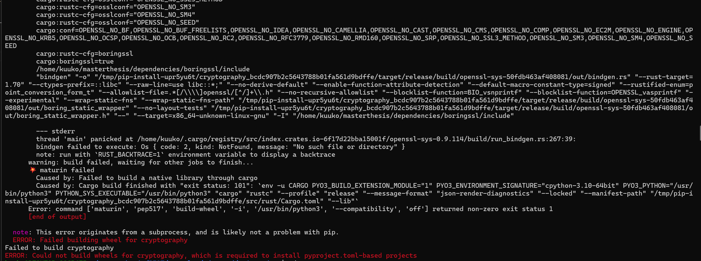
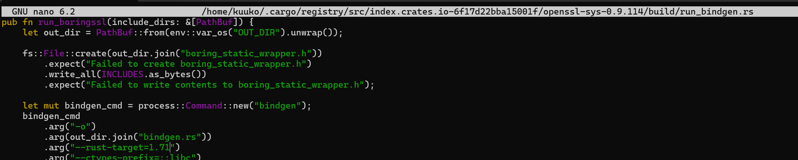
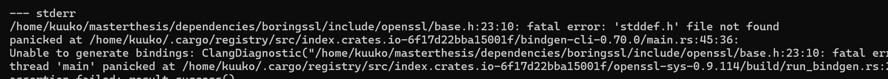

# Development on WSL

To install WSL refer to this [guide](https://doc.riot-os.org/getting-started/install-wsl/) by RIOT-OS.

Attaching a device to WSL refer [here](https://doc.riot-os.org/getting-started/install-wsl/#attach-a-usb-device-to-wsl)

## Set-Up RIOT-OS
Refer to this [guide](https://doc.riot-os.org/getting-started/installing/)

The ubuntu packages required
```
sudo apt install make gcc-multilib python3-serial python3-psutil wget unzip git openocd gdb-multiarch esptool podman-docker clangd clang
```

## Flashing the nRF52840 Dongle

More information can be found under /boards/nrf52840dongle/doc.md

### Prerequisite
[nrfutil](https://www.nordicsemi.com/Products/Development-tools/nRF-Util) needs to be installed. Refer to this [guide](https://docs.nordicsemi.com/bundle/nrfutil/page/guides/installing.html)


`nrfutil install nrf5sdk-tools` needs to be executed

### Attaching the device to WSL


Bind the device as Administrator


Attach the device to WSL

You should hear a Windows plug-in sound

ATTENTION:
To flash the dongle, you have to press the RESET button on the dongle.
Refer [here](https://docs.nordicsemi.com/bundle/ug_nrf52840_dongle/page/UG/nrf52840_Dongle/programming.html)


This is the VID:PID once it's in DFU Bootloader Mode


This is the VID:PID once it's flashed 


Each time you have to reattach the device in Powershell, if WSL is in use.

### Flash hello-world
```
cd ~/RIOT-Base/examples/basic/hello-world
make

```

# SUIT

## Run as native
### Prepare manifest
Execute this under `examples/advanced/suit_update`:
```
BOARD=native make gen-manifest
```

### Set up image server
In a separate terminal execute under `~/RIOT`:
```
sudo dist/tools/tapsetup/tapsetup -c
sudo ip address add 2001:db8::1/64 dev tapbr0
aiocoap-fileserver coaproot
```
### SUIT update via native terminal
Execute this under `examples/advanced/suit_update`:
```
BOARD=native make all term
ifconfig 6 add 2001:db8::2/64
suit fetch coap://[2001:db8::1]/suit_manifest.signed
```


# Using PQC in Python Cryptography
The dependency `cryptography` needs to be installed at the minimum version `47.0.0` to use PQC algorithms such as ML-DSA and ML-KEM.

## WARNING
The latest version `47.0.0` does not use OpenSSL (yet) for PQC instead AWS-LC or BoringSSL is used. This is a conscious decision made by the developers of the python dependency `cryptography` (For more information see here: [The State of OpenSSL for pyca/cryptography](https://cryptography.io/en/latest/statements/state-of-openssl/)).

 Since OpenSSL bases its implementation on BoringSSL (See [here](https://github.com/openssl/openssl/blob/master/doc/designs/ml-dsa.md)), 
 BoringSSL will be installed (See [here](https://cryptography.io/en/47.0.0/installation/#building-with-boringssl-libressl-or-aws-lc) for more information):

```shell
git clone https://boringssl.googlesource.com/boringssl
cd boringssl

# Set to the commit which was used during cryptography's 47.0.0 tests
# See here https://github.com/pyca/cryptography/commit/6cb20b3141c6391ae11075f30b992375c05adad5
git reset --hard 439e53783a5f3829769f84bdd70a46f218fa10ed

cmake -GNinja -B build -DBUILD_SHARED_LIBS=1
ninja -C build -j2

#After this, you get:
#~/boringssl/build/libcrypto.a
#~/boringssl/build/libssl.a

export OPENSSL_LIB_DIR=~/boringssl/build/
export OPENSSL_DIR=~/boringssl/

pip install --no-binary cryptography cryptography
```

Test if it works:
```shell
# This must be executed before using python scripts. This export enables using BoringSSL instead of the system's OpenSSL
export LD_LIBRARY_PATH=~/boringssl/build
python3 ~/RIOT/examples/advanced/test-ml-dsa.py
```

# FAQ


## Cannot run hello-world in WSL Ubuntu
Problem might arise due to wrong file endings during the repository check-out in WSL

e.g. when using `make`
```
/generate_pp_successor_header.sh: not found
or
/genconfigheader.sh: not found
```

Solution:
This command retains the line endings from the repository
```
git config --global core.autocrlf input
```

## Error during cryptography installation

### Invalid Rust Target
When you see an error regarding invalid Rust Target, then switch to the correct Rust version or change the target value inside the file.



```
error: invalid value '1.70' for '--rust-target <RUST_TARGET>': Got an invalid Rust target. Accepted values are of the form "1.71" or "nightly".
```

```
nano ~/.cargo/registry/src/index.crates.io-6f17d22bba15001f/openssl-sys-0.9.114/build/run_bindgen.rs
```



### stddef.h not found


Install these dependencies:
```
sudo apt install build-essential clang
```

### Any build errors regarding `maturin` and `cffi`
```
pip install maturin # Install maturing
pip install --upgrade cffi # Update cffi to version 2
```
